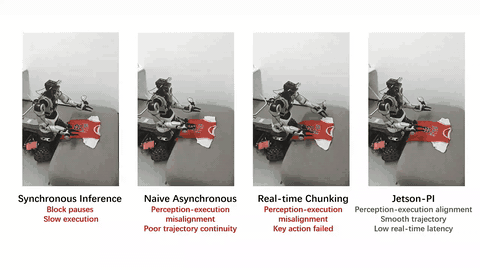

# Jetson-PI

**Jetson-PI: Towards Onboard Real-Time Robot Control via Foresight-Aligned Asynchronous Inference**

Vision-Language-Action (VLA) models have achieved impressive performance on diverse embodied tasks, yet deploying them on low-power onboard devices such as NVIDIA Jetson Orin remains challenging due to high inference latency and limited compute. Asynchronous inference can partially mask this latency, but it introduces **prediction–execution misalignment** and **long reaction time**. Jetson-PI addresses both through **Foresight-Aligned Asynchronous Correction (FAAC)**: we train a lightweight **future correction module** that predicts **future environment representation** conditioned on committed actions, enabling the **action expert** to directly predict actions from the future time step; we further introduce **confidence-based scheduling optimization** that adaptively balances VLM and action expert invocations. This release currently open-sources **LIBERO training and evaluation code** built on **π₀.₅**; the **llama.cpp**-based onboard deployment framework will be released **after the paper is accepted**.

## Real-world Demo



[▶ Full video (mp4)](./video/demo.mp4)

---

## Requirements

| Item | Recommendation |
|------|----------------|
| OS | Ubuntu 22.04 |
| GPU | NVIDIA GPU with **≥ 48 GB** VRAM for full three-stage training (batch 16) |
| Python | **3.11** for training (`uv` / JAX) |
| CUDA | CUDA 12.x (installed via project dependencies; no system CUDA required) |

---

## Environment Setup

### 1. Clone and submodules

```bash
git clone --recurse-submodules <this-repo-url>
cd <repo>
git submodule update --init --recursive
```

### 2. Training environment (JAX)

Install with [uv](https://docs.astral.sh/uv/):

```bash
export PYTHONNOUSERSITE=1
GIT_LFS_SKIP_SMUDGE=1 uv sync
GIT_LFS_SKIP_SMUDGE=1 uv pip install -e .
```

Pin versions are listed in `training_requirements.txt` (Python 3.11, JAX 0.5.3, etc.).

Apply the transformers patch required for π₀.₅ PyTorch/JAX compatibility:

```bash
cp -r ./src/openpi/models_pytorch/transformers_replace/* .venv/lib/python3.11/site-packages/transformers/
```

### 3. LIBERO eval client (simulation)

The policy **server** uses the training venv (`PY_SERVER`). The LIBERO **client** can use `examples/libero/.venv`:

```bash
uv venv --python 3.11 examples/libero/.venv
source examples/libero/.venv/bin/activate
uv pip sync examples/libero/requirements.txt third_party/libero/requirements.txt \
  --extra-index-url https://download.pytorch.org/whl/cu121 --index-strategy=unsafe-best-match
uv pip install -e packages/openpi-client
uv pip install -e third_party/libero
```

Eval-only dependencies are listed in `test_requirements.txt`.

### 4. Paths and checkpoints

#### Download checkpoints (ModelScope)

Pretrained **π₀.₅-LIBERO** + **future correction module** (LIBERO-spatial, step 65000) are hosted on ModelScope:

**[zebinyang/Jetson-PI-pi05](https://www.modelscope.cn/models/zebinyang/Jetson-PI-pi05)**

```bash
pip install modelscope
python -c "from modelscope import snapshot_download; snapshot_download('zebinyang/Jetson-PI-pi05', local_dir='./checkpoints/jetson-pi-pi05')"
export PI0_CHECKPOINT=./checkpoints/jetson-pi-pi05/pi05_libero
export WM=./checkpoints/jetson-pi-pi05/future_correction_module
```

The bundle contains two separate directories (`pi05_libero/`, `future_correction_module/`); do not merge their `params/` trees.

Set these before training or evaluation:

| Variable | Description |
|----------|-------------|
| `PI0_CHECKPOINT` | π₀.₅-LIBERO weights (local dir with `params/`). Use `pi05_libero/` from [ModelScope](https://www.modelscope.cn/models/zebinyang/Jetson-PI-pi05), or download upstream: `gs://openpi-assets/checkpoints/pi05_libero` |
| `WM` | **Eval only.** Path to trained future correction module dir (must contain `params/`). Use `future_correction_module/` from [ModelScope](https://www.modelscope.cn/models/zebinyang/Jetson-PI-pi05) |
| `OPENPI_LIBERO_LOCAL_DATASET_DIR` | LeRobot LIBERO dataset root (parquet + `meta/tasks.jsonl`) |
| `PY` | Python for **training** (JAX venv) |
| `PY_SERVER` | Python for **serve_policy** (must have JAX; often same as `PY`) |

Example:

```bash
export PI0_CHECKPOINT=PATH/TO/CHECKPOINT/pi05_libero
export OPENPI_LIBERO_LOCAL_DATASET_DIR=PATH/TO/DATASET/libero
export PY=PATH/TO/PYTHON
export PY_SERVER=PATH/TO/PYTHON
export PYTHONNOUSERSITE=1
```

---

## Training

### Recipe (current default)

Three-stage schedule on **π₀.₅-LIBERO**:

| Stage | Steps | What is trained |
|-------|-------|-----------------|
| 1 | 30,000 | Action Expert + token reducer (`L_act`) |
| 2 | 15,000 | Future correction module (`L_cond`, no logvar head) |
| 3 | 55,000 | `L_cond` on future correction module (no reducer) + `L_act` on Pi0 AE + full LLM (μ detached) |

Fixed handover **H = 10**, `max_delta_t = 10`, `action_encoder = transformer_block`.

Checkpoints: `checkpoints/<EXP_NAME>/` (Orbax) and `checkpoints/<EXP_NAME>/world_model_step_<N>/`.

### Launch

Use the dedicated launcher (configure paths first):

```bash
cd PATH/TO/REPO
export PI0_CHECKPOINT=PATH/TO/CHECKPOINT/pi05_libero
export OPENPI_LIBERO_LOCAL_DATASET_DIR=PATH/TO/DATASET/libero
export PY=PATH/TO/PYTHON
export CUDA_VISIBLE_DEVICES=0

bash scripts/train_wm_libero_spatial_four_stage.sh
```

Optional overrides:

```bash
export STAGE1_STEPS=30000
export STAGE2_STEPS=15000
export STAGE3_STEPS=55000
export BATCH_SIZE=16
export NUM_WORKERS=4
export EXP_NAME=my_wm_spatial_run
bash scripts/train_wm_libero_spatial_four_stage.sh
```

Logs: `logs/<EXP_NAME>.log`.

---

## Evaluation

Evaluation runs **serve_policy.py** (future correction module + π₀.₅ action expert) and **examples/libero/main.py** (LIBERO sim). Set `WM` to the trained future correction module checkpoint directory.

### Single run (FAAC + async action expert)

```bash
cd PATH/TO/REPO
export PI0_CHECKPOINT=PATH/TO/CHECKPOINT/pi05_libero
export PY_SERVER=PATH/TO/PYTHON
export WM=PATH/TO/future-correction-module
export CUDA_VISIBLE_DEVICES=0
export PORT=8000             # pick a free port

bash scripts/eval_wm_libero_spatial.sh
```

Alternatively, if the checkpoint lives under `checkpoints/<EXP_NAME>/world_model_step_<N>/`:

```bash
export EXP_NAME=<your_training_exp_name>
export STEP=<N>
bash scripts/eval_wm_libero_spatial.sh
```

Outputs under `logs/<run_dir>/`: `serve.log`, `client.log`, `run_meta.txt`, `videos/`.

Default: `libero_spatial`, **50 trials/task**, `H=10`, `K=9`, `overlap=1`.

### Adaptive multi-rollout (confidence-based scheduling)

```bash
export LIBERO_WM_EVAL_ADAPTIVE_KAPPA=1
export LIBERO_WM_EVAL_KAPPA_DELTA=0.4
bash scripts/eval_wm_libero_spatial.sh
```

### Other LIBERO suites

```bash
export LIBERO_WM_EVAL_TASK_SUITE=libero_object   # or libero_goal, libero_10
bash scripts/eval_wm_libero_spatial.sh
```

### K-sweep (advanced)

For sweeping trigger step `K` from 9 down to 1 with adaptive kappa:

```bash
export WM=PATH/TO/future-correction-module
export PI0_CHECKPOINT=PATH/TO/CHECKPOINT/pi05_libero
export PY_SERVER=PATH/TO/PYTHON
export LIBERO_WM_EVAL_KAPPA_DELTA=0.4
bash scripts/libero_wm_eval_spatial_k9to1_adaptive_kappa_low_replan_gpu2_kd0p4.sh
```

---

## Troubleshooting

| Issue | Fix |
|-------|-----|
| `ModuleNotFoundError: No module named 'jax'` in eval | Set `PY_SERVER` to the JAX training venv Python, not system Python |
| OOM during training | Lower `BATCH_SIZE`, set `XLA_PYTHON_CLIENT_MEM_FRACTION=0.85`, or `NUM_WORKERS=0` |
| Missing `norm_stats` in eval | Point `--pi0-norm-checkpoint-dir` / `PI0_CHECKPOINT` to a tree containing `assets/physical-intelligence/libero/norm_stats.json` |
| LIBERO EGL / display errors | Install `xvfb`; eval script falls back to `MUJOCO_GL=egl` if xvfb is missing |
| Checkpoint save killed (no traceback) | First Orbax save can spike host RAM; see `docs/docker.md` and reduce save frequency for smoke tests |

---

## License

See `LICENSE` and `LICENSE_GEMMA.txt`. LIBERO and upstream openpi components retain their respective licenses.
